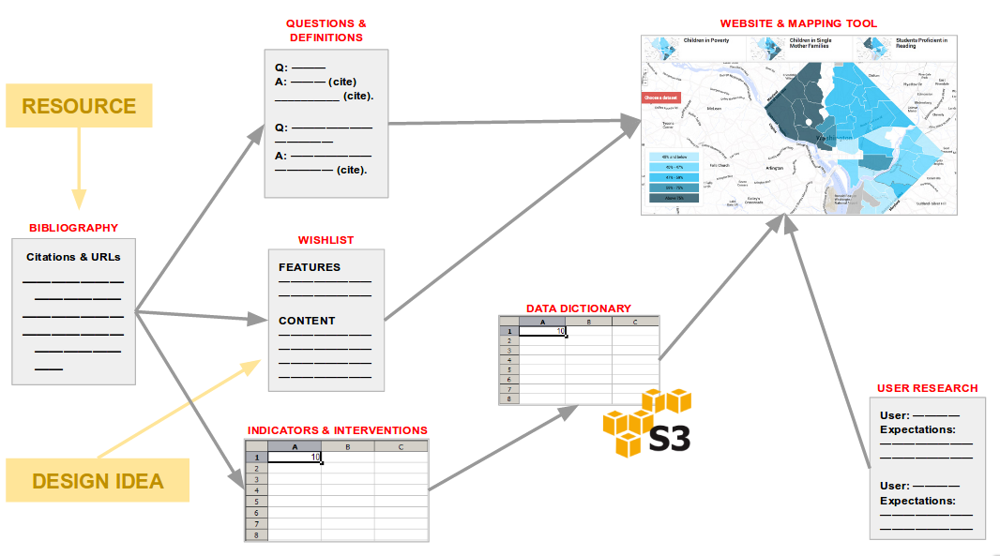
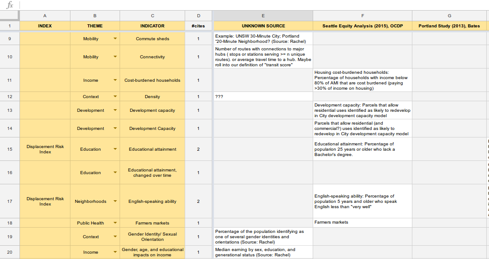

 
***\#TeamEquity** is [Gundula Proksch,](http://realestate.washington.edu/about/people/fellows/gundula-proksch/) associate professor of architecture; [Rachel Berney,](http://realestate.washington.edu/about/people/fellows/rachel-berney/) assistant professor of urban design and planning; [Bernease Herman](http://escience.washington.edu/people/bernease-herman/) and [Amanda Tan,](http://escience.washington.edu/people/amanda-tan/) DSSG data scientists; and DSSG fellows [Hillary Dawkins,](https://uwescience.github.io/DSSG2017//2017/06/16/Hillary_Dawkins.html) [Yahui Ma,](https://uwescience.github.io/DSSG2017//2017/06/16/maya-post.html) [Jacob Kovacs,](https://uwescience.github.io/DSSG2017//2017/06/16/jtkovacs-intro.html) and [Jacob Rich.](https://uwescience.github.io/DSSG2017//2017/06/16/jrich.html)*

## What we’re doing

This summer, building on work by [DC Action for Children,](http://datatools.dcactionforchildren.org/) **\#TeamEquity** will be developing an interactive online tool for investigating urban equity and gentrification in Seattle. Our hope is to bring some clarity and direction to an important and impassioned public discussion, and to help various actors see and understand the potential impact of different actions. We want to provide:

- **Decision-making** support for city leaders
- **Education** for the public
- **Planning** support for built environment professionals
- **Research** support for academics
- **Support** for social service/non-profit organizations

## Unique challenges

As we looked around the WRF Data Science Studio the second week of the DSSG program, it seemed like other fellows were already up to their elbows in data. Not us! In sharing our alarm with each other, we came to realized that our team’s project is fundamentally different from the other 2017 DSSG projects, and that our process this summer will reflect that difference. 

The other DSSG teams are tackling three major data analysis projects, trying to determine the impact of a new light rail station on transit traffic; to extract policy implications from a multi-country collection of agriculturally-relevant datasets; and to identify patterns in downtown Seattle traffic cruising data. Their challenge is to take existing datasets—either single datasets or data collections that have been thoughtfully assembled—and mine them for insights.

Our challenge is much different. Before we start working with data, we have to determine what data is needed and available. This is a conceptual problem first: what is ‘gentrification’? What is ‘urban equity’? What combination of indicators can best stand in for these concepts? Finding satisfactory answers to these questions requires a lot of subject matter knowledge, for which we’ll need to engage significantly with scholarly literature.

## Infrastructure for collaboration

In order to collaborate on refinement of concepts, we spent this week creating shared artifacts and workspaces to help us coordinate our work, build efficiently on each other’s efforts, and improve the reproducibility of our final project:

- We created a **bibliography** in which to store citations or links to useful resources --- articles, websites, similar projects, data visualizations, etc. This is essentially a staging area to hold resources until we have a chance to interact with them and extract useful information.
- **Questions & definitions** is a document for capturing and managing the ideas and definitions we extract from resources. This lays the foundation for pages with *explanatory content* on the final website.
- The **wishlist** captures our ideas for tool features and website content, which may be inspired by resources drawn from the bibliography.
- **Indicators & interventions** is for extracting crucial information from our sources: how have various studies conceptualized/measured gentrification and urban equity? What interventions have been proposed or attempted, with what effect? We'll be choosing our datasets based on this literature review, so it's important to be thorough here. We're using a spreadsheet with a couple of tabs:
    - **Indicators** tab tracks indicators by source and theme (see figure below).
    - **Interventions** tab tracks interventions by source and actor (public, private, nonprofit).
    - **Impact of interventions** maps interventions onto the indicators they affect.
- **Data dictionary:** We created a document for tracking datasets—their contents, origin, spatial unit, and any notes of interest. 
- **User research:** Building on a stakeholder analysis workshop conducted by [DSSG’s resident ethnographers,](http://escience.washington.edu/research-project/ethnography-of-data-science-collaborations/) we created a document for resarching the functionality and UI that various target user groups may expect.

## Next steps

In addition to these documents on Google Drive, moving forward we’ll be storing data in AWS and sharing our code via GitHub. Once data is obtained and cleaned, we expect to use structural equation modeling to enable interactive exploration of policy impacts. Stay tuned!
